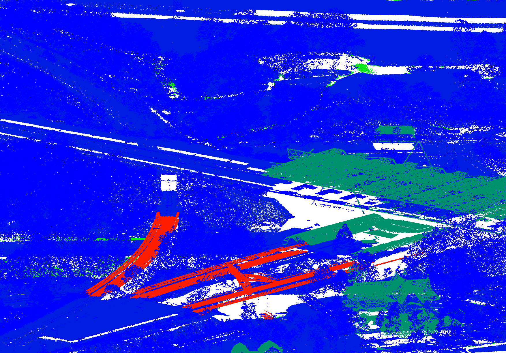
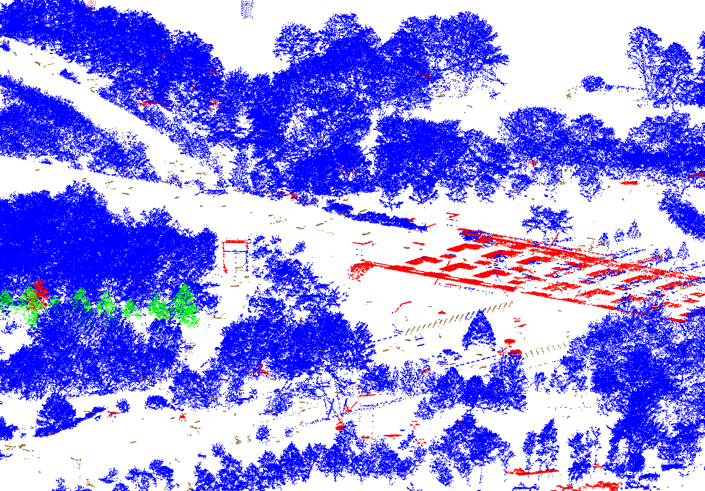
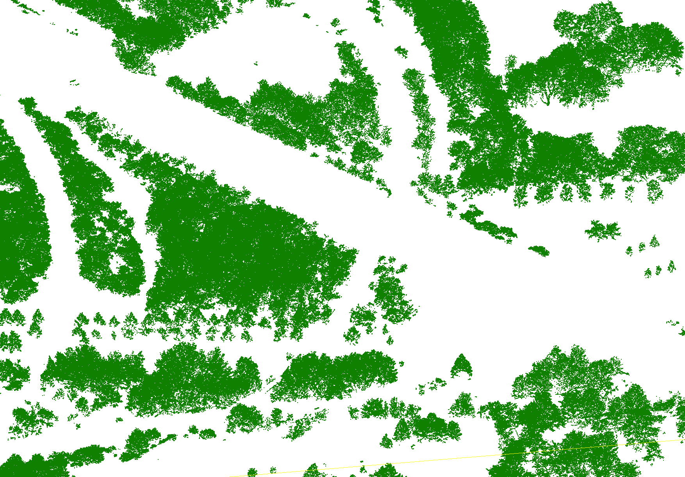

# Tree Detection in Aerial Point Clouds

In this work, we show the use of data processing and deep 3D semantic segmentation network for urban tree detection in aerial point clouds. Point cloud processing consists of a variety of tasks. A few examples are height above ground measuring, normal calculation, clustering and filtering based on point features. The semantic segmentation model classifies the points into either tree-like objects or non-tree-like objects. The model achieves a mean Intersection over Union (mIoU) score of 96% on ten (9/1 train/val split) AHN sub-tiles re-labelled for this project. The dataset used in this work is the [Actueel Hoogtebestand Nederland](https://www.ahn.nl/) (AHN), an openly available elevation model of the Netherlands obtained by aerial laser scanning. We downloaded the point cloud tiles from [geotiles.nl](http://geotiles.nl)

|  | | |
|:---:|:---:|:---:|

<b>Example:</b> (left) AHN original classification. (middle) Preprocessing with the class labels: unknown, tree, noise and other. (right) RandLA-Net classification on the unknown class label. <br/>


---

## Folder Structure

 * [`media/examples`](./media/examples) _Visuals_
 * [`notebooks`](./notebooks) _Jupyter notebook tutorials_
 * [`src/gvl`](./src/upc_sw) _Python source code_

---

## Installation

1. Clone this repository:
    ```bash
    git clone https://github.com/Amsterdam-AI-Team/Tree_Detection_in_Aerial_Point_Clouds.git
    ```

2. Install the dependencies:
    ```bash
    conda env create -f environment.yml
    ```

3. Additionally, install our [Urban PointCloud Processing](https://github.com/Amsterdam-AI-Team/Urban_PointCloud_Processing) package:
    ```bash
    pip install https://github.com/Amsterdam-AI-Team/Urban_PointCloud_Processing/releases/download/v0.1/upcp-0.1-py3-none-any.whl
    ```

4. Finally, install `cccorelib` and `pycc` by following the [instructions on their GitHub page](https://github.com/tmontaigu/CloudCompare-PythonPlugin/blob/master/docs/building.rst#building-as-independent-wheels). Please note, these two packages are not available on the Python Package Index (PyPi).

5. Check out the [notebooks](notebooks) for a demonstration.

---

## Usage

We provide tutorial [notebooks](notebooks) that demonstrate how the code can be used. This repository was designed to be used with the specific data source: AHN. AHN3 or AHN4 point clouds can be downloaded from [ArcGIS](https://www.arcgis.com/apps/Embed/index.html?appid=a3dfa5a818174aa787392e461c80f781) or [GeoTiles](https://geotiles.nl).

---

This repository was created by [Amsterdam Intelligence](https://amsterdamintelligence.com/) for the City of Amsterdam.
