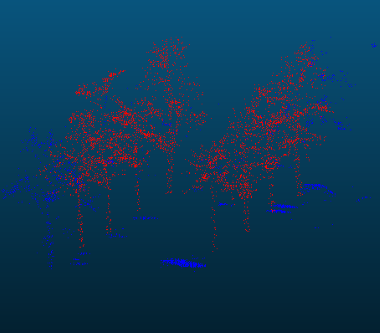

# Tree Detection in Aerial Point Clouds

This repository contains code to automatically extract solitary trees and tree-clusters from aerial point clouds of the [Actueel Hoogtebestand Nederland](https://www.ahn.nl/) (AHN4), an openly available elevation model of the Netherlands obtained by aerial laser scanning. The point cloud tiles can be downloaded from [geotiles.nl](http://geotiles.nl).

The pipeline consists of six steps (see the [`notebooks`](./notebooks)):

0. Pre-processing the raw AHN data by generating subtiles of manageable size and computing the DTM.
1. Extracting trees by using existing labels in the AHN4 data, combined with filters based on point attributes such as normals, reflectance, and return number.
2. Generating GeoTIFF rasters of the results.
3. Generating polygons of the found trees and tree-clusters using the _alpha shape_ method to compute concave hulls.
4. Extracting individual tree trunks from the extracted trees. 
5. Analyzing the predictions of the tree trunks by comparing against ground thruth data. 

<b>Example:</b>

|  |  |
|:---:|:---:|
| Raw AHN4 point cloud | Extracted trees |

|  |  |  |
|:---:|:---:|:---:|
| Tree shapes | Tree trunks | Analysis |

---

## Folder Structure

 * [`media/examples`](./media/examples) _Visuals_
 * [`notebooks`](./notebooks) _Jupyter notebook tutorials_
 * [`src/gvl`](./src/upc_sw) _Python helper functions_

 The code assumes raw AHN4 point cloud tiles are stored in `datasets/AHN4/Source/`.

---

## Installation

1. Clone this repository:
    ```bash
    git clone https://github.com/Amsterdam-AI-Team/Tree_Detection_in_Aerial_Point_Clouds.git
    ```

2. Install the dependencies:
    ```bash
    conda env create -f environment.yml
    ```

3. Finally, install `cccorelib` and `pycc` by following the [instructions on their GitHub page](https://github.com/tmontaigu/CloudCompare-PythonPlugin/blob/master/docs/building.rst#building-as-independent-wheels). Please note, these two packages are not available on the Python Package Index (PyPi).

4. Check out the [notebooks](notebooks) for a demonstration.

---

## Usage

We provide tutorial [notebooks](notebooks) that demonstrate how the code can be used. This repository was designed to be used with the specific data source: AHN. AHN3 or AHN4 point clouds can be downloaded from [ArcGIS](https://www.arcgis.com/apps/Embed/index.html?appid=a3dfa5a818174aa787392e461c80f781) or [GeoTiles](https://geotiles.nl).

---

This repository was created by [Amsterdam Intelligence](https://amsterdamintelligence.com/) for the City of Amsterdam.
